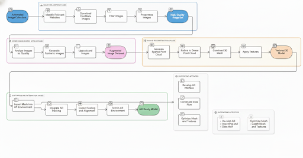
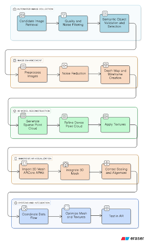
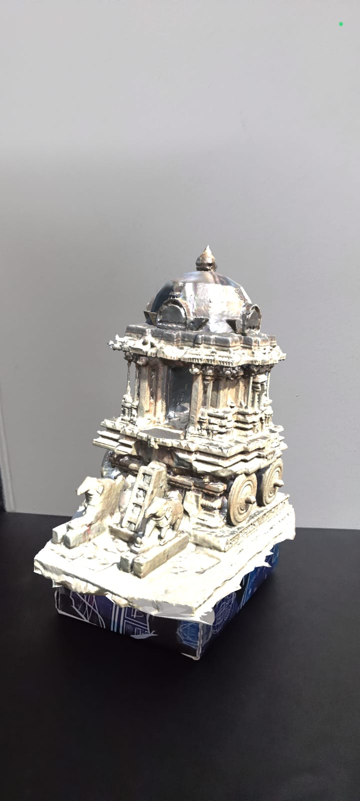

# HistARy - History in Augmented Reality

> A digital preservation initiative to reconstruct and visualize heritage monuments using 3D photogrammetry and Augmented Reality.

### 🏛️ The Vision
Historical monuments suffer constant degradation due to weathering and human activity, often leaving us with only fragmented ruins. Conventional restoration is expensive and invasive.

**HistARy** was built to bridge the gap between historical archives and modern experience. Our goal is to create a scalable, non-invasive system that "revives" these structures digitally. By combining automated data collection with 3D reconstruction and AR, we allow researchers and tourists to visualize history in its original context without altering the physical site.

---

### ⚙️ The Pipeline
The system operates on a four-stage pipeline, moving from raw internet data to an immersive mobile experience.

  
*Fig 1: High-level process flow from image collection to AR visualization.*

1.  **Automated Collection:** We built a scraping module that gathers images of specific heritage sites (e.g., Hampi Chariot) and filters them using semantic validation (CLIP) to remove noise and duplicates.
2.  **Enhancement & Preprocessing:** Raw images are processed to reduce noise and enhance structural edges. This step generates depth maps and wireframes essential for accurate 3D feature extraction.
3.  **3D Reconstruction:** Using Structure-from-Motion (SfM) and Multi-View Stereo (MVS), the system converts 2D images into dense 3D point clouds and textured meshes.
4.  **AR Visualization:** The optimized models are deployed to a mobile app. The system uses a "Look-Lock-Render" logic to anchor the digital model over the physical ruins in real-time.

---

### 🛠️ Tech Stack

**Core Processing**
* **Python 3.8+** (Scripting & Pipeline orchestration)
* **OpenCV & PIL** (Image processing & watermark removal)
* **NumPy & SciPy** (Numerical computation)

**AI & Computer Vision**
* **COLMAP (CUDA)** (Photogrammetry & 3D Reconstruction)
* **YOLOv8** (Object detection for filtering)
* **CLIP & BLIP** (Semantic validation & Zero-shot classification)

**Visualization & Deployment**
* **Unity 6 / 2023 LTS** (AR Development Environment)
* **Vuforia Engine 10.x** (Marker-based tracking & Anchoring)
* **Blender** (Mesh inspection & UV validation)

---

### 🔬 Implementation Overview
The implementation focuses on modularity. Each stage of the pipeline functions independently, allowing us to swap out components (like the denoising algorithm or the tracking engine) without breaking the whole system.

We utilize **local processing** for the reconstruction to ensure data privacy and handle computationally heavy tasks like dense point cloud generation. The final AR deployment is optimized for mobile, utilizing **device-side databases** for target recognition to eliminate latency and dependency on internet connectivity during the site visit.

---

### 📸 Results

**Reconstruction Output**
Below is a comparison of the input image, the enhanced wireframe extraction, and the final 3D geometry.

**AR Demo**
See the system in action tracking the Hampi Chariot model over a physical target.

